# 需求到代码生成：场景分析与公共平台设计蓝本

---

## 目录

### 正文：10 个业务场景
#### 主线场景（端到端 7 阶段，"需求→合入"链）
- [场景1 存量代码接手——读懂基线再动手](#场景1-存量代码接手读懂基线再动手)
- [场景2 三级分解澄清——把一句话落成可验收原子项](#场景2-三级分解澄清把一句话落成可验收原子项)
- [场景3 定规格设计——WHAT/HOW 双产物与产物分层](#场景3-定规格设计whathow-双产物与产物分层)
- [场景4 人工门会诊拍板——人确认方案与回退](#场景4-人工门会诊拍板人确认方案与回退)
- [场景5 AI 自动迭代写代码与人中途接管](#场景5-ai-自动迭代写代码与人中途接管)
- [场景6 多维并行评审与对抗式修复闭环](#场景6-多维并行评审与对抗式修复闭环)
- [场景7 持续检视闭环——MR 监听态到合入](#场景7-持续检视闭环mr-监听态到合入)
#### 横切场景（贯穿主线，非单一阶段）
- [场景8 并发多任务与会话厅调度](#场景8-并发多任务与会话厅调度)
- [场景9 无人值守模式的边界与降级](#场景9-无人值守模式的边界与降级)
- [场景10 知识、技能与流程模板从任务反哺沉淀](#场景10-知识技能与流程模板从任务反哺沉淀)

### 附录：机制索引（可查设计词典）
- [A. 业务流主线与 7 阶段](#a-业务流主线与-7-阶段) · [B. 角色模型与协作范式](#b-角色模型与协作范式) · [C. 人机交互与交接](#c-人机交互与交接) · [D. 工作台三层骨架与统一作业流](#d-工作台三层骨架与统一作业流) · [E. 四层扩展机制](#e-四层扩展机制) · [F. 门禁、并发、可观测性](#f-门禁并发可观测性) · [G. 四套件收敛映射表](#g-四套件收敛映射表) · [H. 共性要素与设计原则清单](#h-共性要素与设计原则清单)

### 收口：目标态平台设计方案
- [I. 从场景分析到平台设计——目标态收口](#i-从场景分析到平台设计目标态收口)

---

# 正文：10 个业务场景

> 每个场景以 **Use Case 图** 为主干（Actor + 主成功路径 + 分支 + 成功准则），文字辅助。场景1~7 是**主线场景**，按"需求→合入"端到端 7 阶段顺序串联；场景8~10 是**横切场景**，贯穿主线任一阶段。

## 场景在端到端主线上的位置

> 10 个场景串在"需求到代码合入"端到端主线上，覆盖设计/开发/测试多职能与需求方/检视人/合入方多角色协同。下表与图把场景按主线阶段排布，标出主导角色与上下游衔接——**先看全景再读单场景**。

| 主线阶段 | 场景 | 核心张力 | 主导角色 | 参与角色 | 上下游衔接 |
|---|---|---|---|---|---|
| ①接单开张 | **场景1** 存量代码接手 | 看不懂的存量 vs 必须动手 | 开发 | — | 上游：需求单；下游：把基线交给场景2 澄清 |
| ②需求澄清 | **场景2** 三级分解澄清 | 模糊一句话 vs 可验收原子项 | 开发+AI | 需求方（答事实）| 上游：场景1 基线；下游：原子项交给场景3 设计 |
| ③定规格设计 | **场景3** 定规格设计 | 散文设计 vs 结构化清单·过程物污染交付物 | 设计师 | 开发（拍板）| 上游：场景2 原子项；下游：方案交场景4 审核 |
| ④人工审核门 | **场景4** 人工门会诊拍板 | 卡不卡人·单拍板vs会诊·回退无限循环 | 检视人 | 开发（待回退）| 上游：场景3 方案；通过→场景5，驳回→回场景2/3 |
| ⑤写代码 | **场景5** AI 自动迭代与人接管 | AI 自主推进 vs 人随时接管·自报vs证据 | 开发+AI | — | 上游：场景4 放行；下游：代码交场景6 验证 |
| ⑥构建验证 | **场景6** 多维并行评审与对抗修复 | 单检视人 vs 多维并行·修复无限循环·伪造报告 | 检视人/Critic | 测试 | 上游：场景5 代码；通过→场景7，失败→回场景5 |
| ⑦持续检视闭环 | **场景7** 持续检视闭环 | MR 创建即终态 vs 监听态·自报vs真闭合 | 合入方 | 开发（修复）| 上游：场景6 验证通过；终态：合入；反馈→回场景5 |
| 横切·并发 | **场景8** 并发多任务与会话厅调度 | 人多任务 vs 并发槽有限·等门阻塞机器 | 开发 | — | 横切①~⑦：任一阶段都可能多任务并发 |
| 横切·值守 | **场景9** 无人值守的边界与降级 | AI 自主 vs 铁门不代答·跑飞烧资源 | AI（人缺席）| 开发（晨间）| 横切①~⑦：夜间自动推进，门处挂起 |
| 横切·沉淀 | **场景10** 知识技能流程模板反哺 | 会用不会学·AI 自我强化错误做法 | 开发（评审采纳）| 团队 | 横切①~⑦：任务过程产出反哺，下次任务复用 |

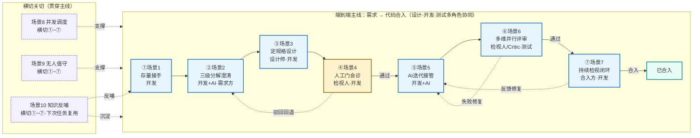

**怎么读这张图**：
- **主线左右流**：场景1→2→3→4→5→6→7 是一条从需求到合入的顺序链，每场景承接上游产物、向下交付。场景4（门）与场景6（验证）是两个回退分叉点——驳回/失败都退回上游重做。
- **角色接力**：主导角色随阶段前移——需求方答事实（场景2）→设计师主笔（场景3）→检视人拍板（场景4/6）→开发+AI 编码（场景5）→合入方拍板（场景7）。每个阶段一个拍板人，权责分明。
- **横切三场景**：场景8/9/10 不占主线某个位置，而是贯穿所有阶段——并发调度支撑任一阶段多任务、无人值守支撑夜间任一阶段自动推进、知识反哺从任一阶段产出沉淀并反哺下次任务的开张（场景1）。

---

## 场景1 存量代码接手——读懂基线再动手

### Use Case

- **Actor**：开发王浩
- **目标**：动手改之前先读懂本次改动涉及的代码切片、建立基线（动手前对要改的代码的理解快照），避免改错地方或漏调用链。
- **情境**：接到"会员中心"存量（已有代码库）改造单（积分模块加"过期提醒"），仓库 3 万行、跨 2 个微服务，王浩没碰过这块——直接动手会改错、全量（读懂整个仓库）读懂又耽误开工。
- **成功准则**：本次改动切片（含根级配置/入口）已读懂并建立基线，经双层自动校验放行，可进入设计阶段。
- **上游 / 下游**：上游=需求单；下游=把基线交给场景2 澄清。

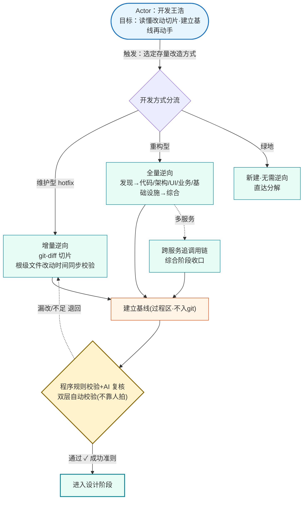
> **图读法**：圆角节点是 Actor 与目标；实线是主交互流程，虚线是分支/退回；`✓ 成功准则` 标注达成判据。王浩只触发分流，逆向（读懂既有代码建立基线）与校验由系统自动完成——增量（只看本次改动涉及的代码）走 git-diff 切片、全量重建完整心智、绿地（全新项目无既有代码）跳过逆向；产物落过程区（过程草稿不入库的产物层）作基线，经机器门（不靠人、由程序规则+AI 自动判定的关卡）放行。

---

## 场景2 三级分解澄清——把一句话落成可验收原子项

### Use Case

- **Actor**：需求方张明（PO）
- **目标**：把一句话需求落成"可单点实现、可单点验收"的原子项（最小需求项），自己不懂流程、提完就想走。
- **情境**：张明在会话厅（一屏列出自己名下所有任务的入口页）输入"会员积分过期提醒……月底前给近 30 天将过期积分的用户发推送"，挂"会员中心"、选仓。一句话到可验收原子项之间隔着澄清与分解。
- **成功准则**：一句话已落成可验收原子项（可结构化为三级分解 IR→SR→AR：意图需求→场景需求→原子需求，逐级拆细），业务事实有决策记录，任务转"方案中"。
- **上游 / 下游**：上游=场景1 基线；下游=原子项交给场景3 设计。

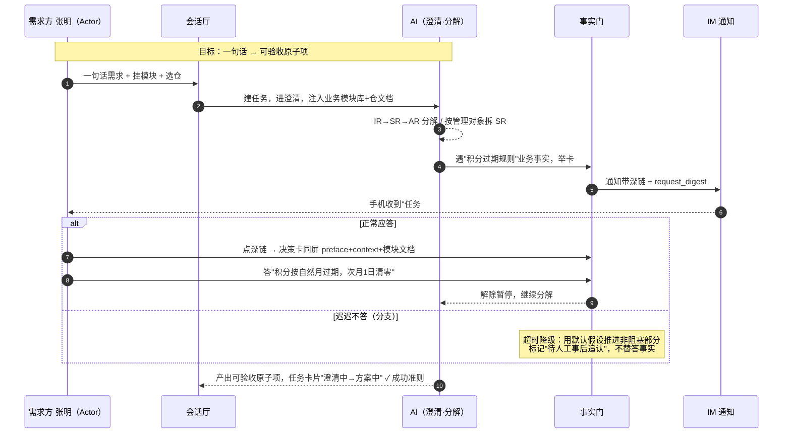
> **图读法**：Actor 是张明；实线为主交互流程；`alt` 块是分支（正常应答 vs 超时不答）；`✓ 成功准则` 标注达成判据。遇业务事实时举卡（暂停流程、把待办推给指定的人）到事实门（卡住等人回答业务事实的强制确认点，不答不放行），通知带深链（点开直达该任务待办详情的链接）；张明点开后看决策卡（把依据同屏摆出来，反盲签——防止看都不看就点通过）作答。事实门只记录回答不校验对错，答错由后续审核门（代码/方案要人审签通过的关卡）复查；超时则降级（用默认假设推进非阻塞部分，标记"待人工事后追认"，不替答事实）。

---

## 场景3 定规格设计——WHAT/HOW 双产物与产物分层

### Use Case

- **Actor**：设计师李婉（主笔）+ 开发王浩（拍板人，做出最终决策）
- **目标**：协作出 WHAT（spec）/HOW（design）双产物，对"推送渠道选短信还是 App 内信"达成一致，且过程草稿不污染交付、契约不漂移。
- **情境**：任务进入方案阶段，李婉与 AI 多轮打磨 spec，王浩原位批注（在产物上原位留的讨论意见）讨论。两人要对渠道选择达成一致。
- **成功准则**：双产物落盘交付区（交付物入库的产物层）；过程草稿不入 git；契约单源（接口/参数定义只在一个地方维护，其余都是只读派生）无漂移；开发拍板后主权（当前谁有权改这个产物）移交开发。
- **上游 / 下游**：上游=场景2 可验收原子项；下游=方案交场景4 审核。

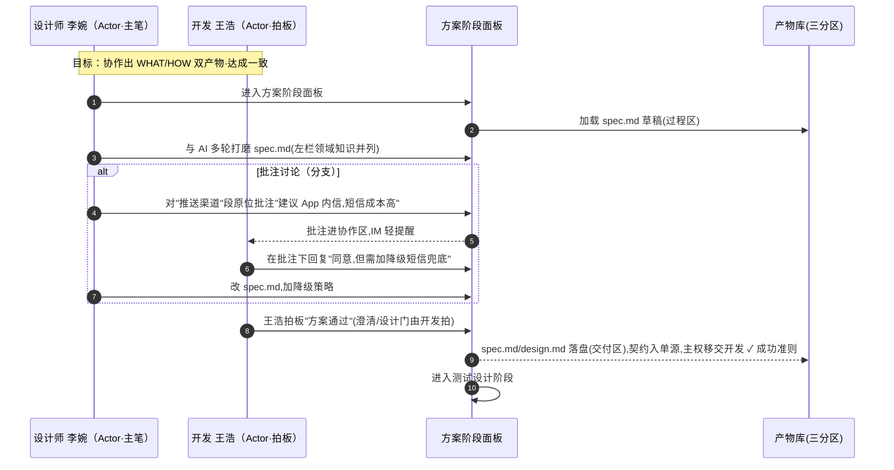
> **图读法**：两个 Actor——李婉主笔、王浩拍板；主权属李婉时王浩只读+批注，拍板后主权移交。`alt` 块是批注讨论分支（可多轮，收敛后才拍板）。产物按三分区（过程区/交付区/知识区三层）治理：过程草稿留过程区（过程草稿不入库的产物层）不入 git，交付物落交付区（交付物入库的产物层）。

---

## 场景4 人工门会诊拍板——人确认方案与回退

### Use Case

- **Actor**：检视人赵磊（唯一拍板人）+ 安全组孙琳（会诊（邀请多人一起审，但只有一个人能拍板），非拍板）
- **目标**：在证据同屏（非盲签）下对方案做出唯一拍板——通过则放行进编码；驳回则附理由、声明式回退（驳回时直接指定退回到哪一步，而非从头重跑）到目标阶段，不无限循环。
- **情境**：积分提醒代码写完进审核门。赵磊被 IM 拉进来，邀请孙琳会诊。赵磊发现测试覆盖不足，决定驳回回退到测试设计重做。门要卡住人但不能人缺席就死卡；会诊意见可冲突但拍板权唯一。
- **成功准则**：检视人做出唯一拍板（通过放行 / 驳回附理由声明式回退），不无限循环。
- **上游 / 下游**：上游=场景3 方案；通过→下游场景5 编码，驳回→回退场景2/3。

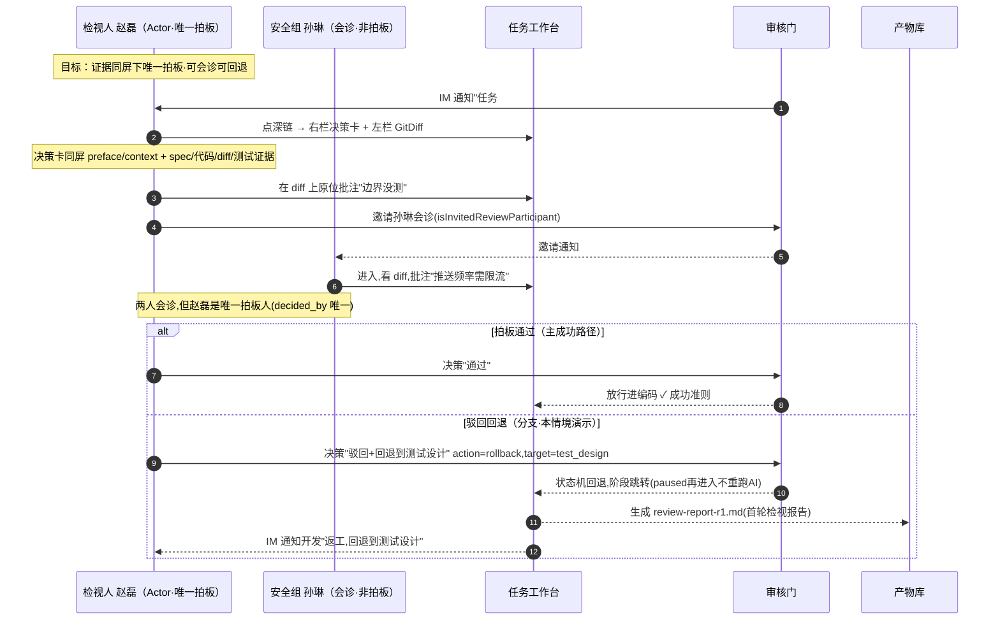
> **图读法**：Actor 是赵磊（唯一拍板），孙琳会诊不拍板。`alt` 区分主成功路径（通过放行）与分支（驳回声明式回退）。门超时升级（门等人超时后往上通知，不自动放行）；多轮返工有 `repair_rounds`（重试预算：失败重试的次数上限，超了就停并通知人）上限防无限循环。

---

## 场景5 AI 自动迭代写代码与人中途接管

### Use Case

- **Actor**：开发王浩 + AI（构造阶段）
- **目标**：放任 AI 自动写代码，人可随时拿回方向盘；接管时状态不不一致；自报完成以文件证据裁决。
- **情境**：王浩把积分提醒放任 AI 自动写，自己先去看别的任务。中途 AI 反复试错一个不存在的接口，健康徽标（任务状态指示灯，异常时变黄/红主动叫人）转黄，他决定接管。（多任务并发调度见场景8，本场景聚焦单任务内 AI 自治与人接管的交接。）
- **成功准则**：AI 自主推进可被人随时接管且状态不不一致（中断非失败）；AI 自报完成以文件存在校验裁决；接管后保持"人在控"直到显式恢复自动。
- **上游 / 下游**：上游=场景4 放行；下游=代码交场景6 验证。

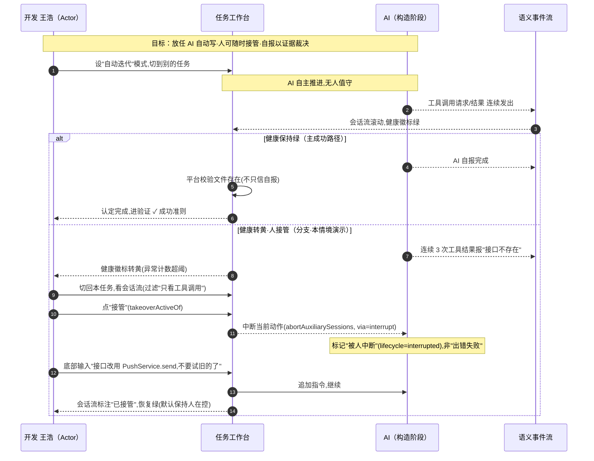
> **图读法**：Actor 是王浩（与 AI 协作）。`alt` 区分主成功路径（健康绿→自报→文件校验通过）与分支（健康转黄→人接管）。接管以 `via=interrupt` 标记，区别于 AI 出错失败。过程由语义事件流（用统一事件类型记录全过程，看一种流就能回看任何阶段）记录，多任务切换丢上下文由会话厅任务卡片+事件流回看解决（见场景8）。

---

## 场景6 多维并行评审与对抗式修复闭环

### Use Case

- **Actor**：Critic（独立终审角色，不参与写代码、只对各维度结论做最终裁决）+ 各维度检视 Agent
- **目标**：把评审拆成多维度并行各维独立判定，Critic 单一终审汇总；不通过的进对抗式修复（评审方和修复方分开，改完回请原评审复检）闭环，不无限打转，报告防伪造。
- **情境**：积分提醒代码写完进构建验证。单检视人（审代码的人）一次性看全容易漏维度——功能对了但安全没看、性能没测。
- **成功准则**：各维独立判定 + Critic 单一终审通过；评审范围与实现范围一致；报告可追溯防伪造；编译+测试通过，进入持续检视闭环。
- **上游 / 下游**：上游=场景5 代码；通过→下游场景7，失败→回场景5 修复。

```mermaid
flowchart LR
    ACT(["Actor：Critic（独立终审）<br/>目标：多维并行评审·单一终审·对抗修复不无限打转"])
    ACT --> RevSub
    subgraph RevSub["多维并行评审（各维独立 PASS/WARN/FAIL）"]
        direction TB
        D1["功能正确性"]
        D2["架构合理性"]
        D3["安全性"]
        D4["性能"]
        D5["可维护性"]
        D6["测试充分性"]
    end
    RevSub --> CRITIC["Critic 终审<br/>汇总各维度 → 整体裁决<br/>(验证报告来源交叉校验防伪)"]
    CRITIC --> BUILD["编译构建"] --> TEST["测试执行"]
    TEST -->|通过| OUT["进入持续检视闭环 ✓ 成功准则"]
    CRITIC -.需修复.-> DEC{修复轮次}
    TEST -.失败.-> DEC
    DEC -->|未超限 如小于10轮| FIX["修复模式回写代码<br/>改完回请原维度复检"]
    DEC -.超限.-> MANUAL["升级人工介入"]
    FIX --> RevSub
    MANUAL --> OUT

    classDef actor fill:#e7f5ff,stroke:#1971c2,stroke-width:2px;
    classDef verify fill:#fff4e6,stroke:#d9480f,stroke-width:1px;
    classDef fail fill:#fff5f5,stroke:#c92a2a,stroke-width:1px;
    classDef dim fill:#e7f5ff,stroke:#1971c2,stroke-width:1px;
    classDef success fill:#e6fcf5,stroke:#0c8599,stroke-width:2px;
    class ACT actor;
    class D1,D2,D3,D4,D5,D6 dim;
    class BUILD,TEST,CRITIC verify;
    class FIX,MANUAL fail;
    class OUT success;
```
> **图读法**：Actor 是 Critic（独立终审，不参与生成）。实线是主成功路径（多维并行→Critic 终审→编译测试→通过），虚线是分支（终审/测试不通过→对抗式修复回请原维度复检，轮次超限升级人工）。维度数与是否设 Critic 均为模板可配项，默认单检视人轻量。

---

## 场景7 持续检视闭环——MR 监听态到合入

### Use Case

- **Actor**：合入方周杰（仓的合入权限人，唯一拍板，永远人工）
- **目标**：确认远端流水线真过、反馈全消化后再合入——MR 创建是监听态非终态，合入才终态；AI 自称"已处理"不算闭合，要真闭合。
- **情境**：积分提醒通过审核与测试进交付门。MR 创建后，外部评审意见、远端流水线结果、检视反馈持续到来。周杰要看流水线真过、反馈消化完再合入。
- **成功准则**：5 类反馈全消化（SHA 校验、幂等重放）、远端流水线真绿、合入方拍板合入；合入为终态，工作区回收。
- **上游 / 下游**：上游=场景6 验证通过；终态=合入；反馈需修复→回场景5。

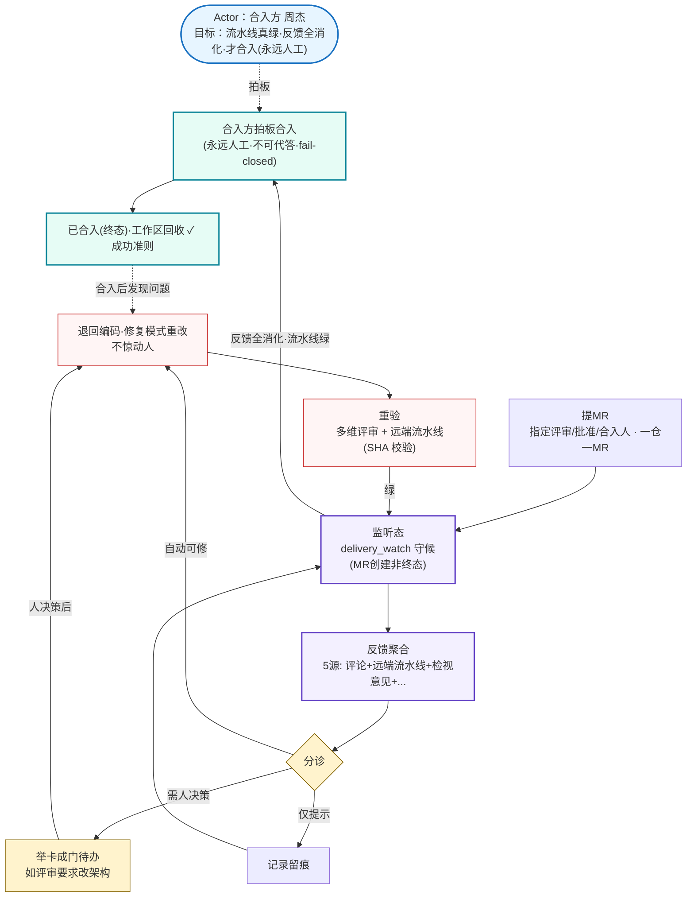
> **图读法**：Actor 是合入方周杰（唯一拍板，永远人工不可代答）。实线是主成功路径（提MR→监听态→反馈聚合分诊→重验→全消化·流水线绿→拍板合入），虚线是分支（自动可修退回编码不惊动人、需人决策举卡、合入后发现问题回滚）。SHA 一变旧证据失效防 AI 自报"已处理"。

---

## 横切场景（贯穿主线①~⑦，非单一阶段）

> 以下场景8/9/10 不绑定主线某个阶段，而是横切关切：并发调度支撑任一阶段多任务、无人值守支撑夜间任一阶段自动推进、知识反哺从任一阶段产出沉淀并反哺下次任务开张。

---

## 场景8 并发多任务与会话厅调度

### Use Case

- **Actor**：开发王浩（名下 5 个并发任务）
- **目标**：人思考（等门）不阻塞机器；并发槽有限要公平调度；状态不多处真源打架；任务切换不丢上下文。
- **情境**：王浩名下同时 5 个任务——2 个在跑、1 个在审核门等他看、1 个排队、1 个已合入。部署只允许 2 个并发。
- **成功准则**：等门任务不占并发槽（容器释放可恢复）；并发槽公平调度不超限；状态一处真源多处只读不打架；任务切换不丢上下文。
- **上游 / 下游**：横切①~⑦，不绑定单一阶段——任一主线场景的多任务并存都由本场景调度。

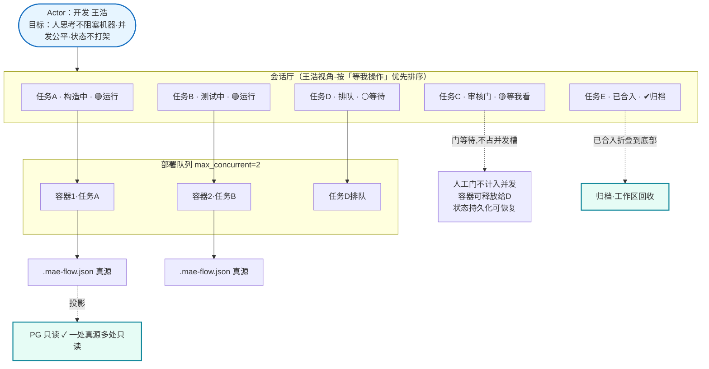
> **图读法**：Actor 是王浩。会话厅一屏可见多任务（徽标区分运行/等待/排队/归档），运行任务占并发槽、等门任务释放槽让给排队，状态一处真源多处只读。任务切换不丢上下文靠真源文件+事件流回放。

---

## 场景9 无人值守模式的边界与降级

### Use Case

- **Actor**：AI（人缺席，夜间自动模式）+ 开发（晨间接手）
- **目标**：AI 自主推进能做的部分，铁门不代答、跑飞不烧资源、夜间通知不爆炸、重启不丢状态。
- **情境**：夜里 2 点，一个低风险文档修正任务在自动模式跑。测试门通过后准备进交付门（要人），同时构建突然失败。
- **成功准则**：能自动推进的部分已推进到位；铁门挂起等人不偷偷放行；跑飞有重试预算超限停止不烧资源；通知合并到早上；重启按阶段矩阵恢复不丢状态、不幻影交付。（终态是"铁门挂起+待修复事项清单"，非偷偷合入。）
- **上游 / 下游**：横切①~⑦，不绑定单一阶段——夜间任一主线场景自动推进、遇铁门挂起、跑飞降级都由本场景值守。

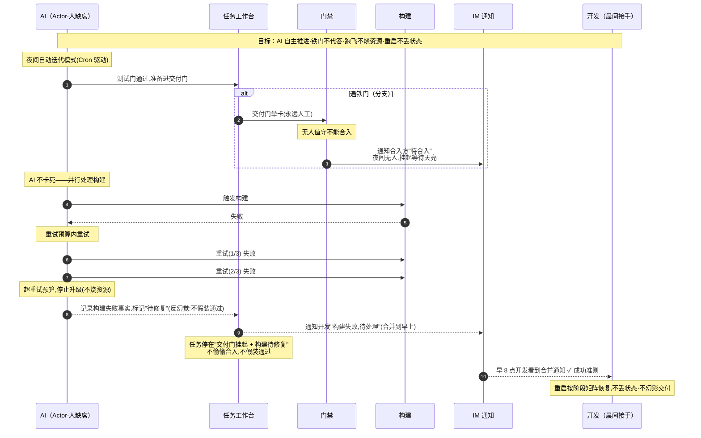
> **图读法**：Actor 是 AI（人缺席），开发晨间接手。`alt` 块是遇铁门分支（挂起等人不代答）；构建失败在重试预算内重试，超限停止升级不烧资源。通知合并到早上，重启按阶段矩阵恢复。反幻觉：不假装通过，交付事实来自远端真实。

---

## 场景10 知识、技能与流程模板从任务反哺沉淀

### Use Case

- **Actor**：开发王浩（评审采纳）+ 团队
- **目标**：把过程中发现的"PushService 需限流，否则高频推送会被网关熔断"沉淀成团队技能，让下次类似任务不再踩坑。
- **情境**：积分提醒任务合入后，这条经验应沉淀成团队技能。张力：会用不会学；AI 自我强化错误做法（候选技能自动生效）；经验留批注没进证据流。
- **成功准则**：候选技能经人工采纳进入正式团队技能架（候选不自动生效）；写入 fail-closed 留痕可回滚；下次同类任务开局自动物化技能架注入，验证技能生效、不再踩坑。
- **上游 / 下游**：横切①~⑦，从任一主线场景产出沉淀；反哺下游=下次任务开张（场景1）物化技能架注入，闭环。

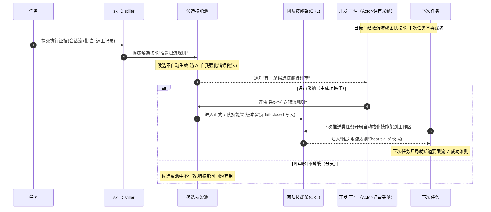
> **图读法**：Actor 是王浩（评审采纳）。`alt` 区分主成功路径（采纳→进技能架→下次任务物化注入→不再踩坑，闭环验证）与分支（驳回/暂缓，候选不生效）。候选技能不自动生效防 AI 自我强化；写入 fail-closed 留痕，错技能可回滚。Julo 缺口（coding-rules 静态硬编码无反哺）是公共工作台必须补的回路。

---

## 场景摩擦清单与设计硬约束

> 走完 10 个场景，把摩擦汇总为四类，提炼场景检验后淘汰不掉的硬约束——它们是公共平台"能用"与"好用"的分界线。

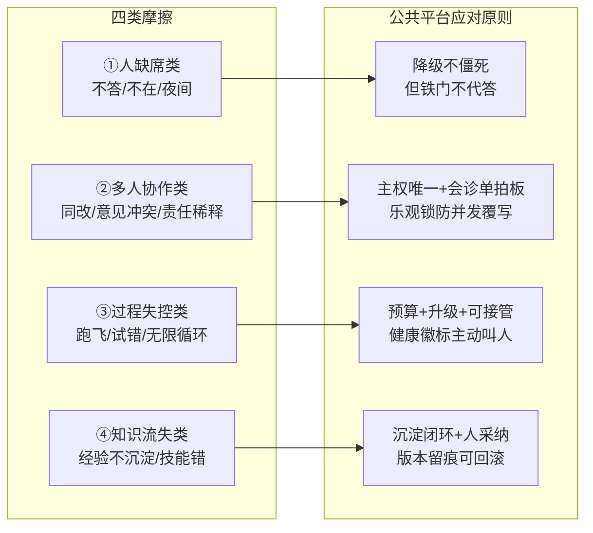

### 摩擦-应对总表

| 摩擦类别 | 典型场景 | 公共平台应对（回扣机制） |
|---|---|---|
| **人缺席·不答** | 场景2 张明迟答 | 事实门超时降级推进非阻塞部分，但不替答事实（`[机-超时升级]`）|
| **人缺席·夜间** | 场景9 无人值守 | 交付门挂起等人不降级，通知合并到早上（`[机-铁门永不代答]`/`[机-通知合并]`）|
| **多人·同改产物** | 场景3 李婉王浩同改 spec | 产物主权随阶段流转，非主权方只读+批注（`[机-产物主权流转]`）|
| **多人·意见冲突** | 场景4 赵磊孙琳冲突 | 会诊单拍板，`decided_by` 唯一（`[机-会诊单拍板]`）|
| **多人·并发审批** | 场景4 多浏览器同时点通过 | 乐观锁 `state_version`，先到先得后者知情（`[机-一处真源]`）|
| **过程·AI 试错跑飞** | 场景5 王浩接管 | 健康徽标变色主动叫人，`takeoverActiveOf` 随时接管（`[机-接管 via=interrupt]`/`[机-健康徽标]`）|
| **过程·返工无限循环** | 场景4/6 多轮返工 | 返工轮次上限 `repair_rounds`，超限升级（`[机-轮次超限升级]`）|
| **过程·构建失败重试** | 场景9 夜间构建失败 | 重试预算超限停止，质量失败如实记录不阻断 done（`[机-重试预算升级]`）|
| **过程·伪造评审报告** | 场景6 假报告 | 验证报告做来源交叉校验 + 保留分派记录 + 决策标识归因（`[机-评审报告防伪]`）|
| **知识·经验不沉淀** | 场景10 限流经验流失 | skillDistiller 沉淀闭环，扫描批注+会话+返工（`[机-技能沉淀闭环·人采纳]`）|
| **知识·技能采纳错** | 场景10 错技能污染 | 人采纳才生效，版本留痕可回滚（`[机-写入 fail-closed 留痕]`）|
| **通知·打扰频繁** | 场景2/9 通知爆炸 | `notified` 防重复，按任务合并，按优先级排序（`[机-通知合并]`）|
| **并发·等门占资源** | 场景8 任务C等门占容器 | 人工门释放并发槽，状态持久化可恢复（`[机-门不占并发槽]`）|
| **状态·真源打架** | 场景8 前后端DB不一致 | 一处真源多处只读（`[机-一处真源]`）|

### 从场景反推的四条设计硬约束

走完 10 个场景，公共平台有四条**不可妥协的硬约束**——它们不是单点设计，而是所有场景的共同前提：

1. **铁门永不代答**（场景2/4/7/9）：事实门、审核门、交付门涉及人工守的边界，无人值守也不偷偷放行。AI 可以降级推进非阻塞部分，但**该人守的门挂起等人**，不伪装通过。`[机-铁门永不代答]`
2. **决策必有证据同屏**（场景2/4/7）：所有门禁决策卡带 `preface`/`context`/材料选区，反盲签是硬要求。让人在"看得见为什么问、看得见依据"的前提下拍板，杜绝盲签。`[机-反盲签决策卡]`
3. **过程永远可接管可回溯**（场景5/6/8）：语义事件流统一记录所有过程，人随时可接管（`via=interrupt`）、可回看（任务历程 `TaskJourney` + 双指针）、可追责（`decided_by` 记录谁拍板 + 操作留痕）。AI 自主性越强，可接管可回溯就越必须是底线。`[机-语义事件流]`/`[机-溯源链]`
4. **产物分层契约单源**（场景1/3/10）：过程物与交付物物理隔离，契约唯一真源防多版本漂移，知识区可回流团队资产。`[机-产物分层·三分区]`/`[机-契约单源]`

这四条与附录 H 的设计原则一脉相承，但更尖锐——它们是**场景检验后淘汰不掉的硬约束**，是公共平台"能用"与"好用"的分界线。

# 附录：机制索引

> 本附录把四套件业务流 / 协作 / 工作台分析压缩为 8 个机制条目组（A-H），是场景正文反向引用的可查设计词典。每条给定义 + 关键图（仅主干）+ 指向挂载场景。**场景为主入口，遇 `[机-Mx]` 查此附录。**

---

## A. 业务流主线与 7 阶段

四套件做的是同一件事：把一个需求/缺陷，从"一句话描述"变成"合入代码库的代码变更"。主干 7 阶段一一对应，BDFlow 多出 P0 存量逆向、SUPER-HARNESS 把澄清拆成 IR→SR→AR 三级，是粒度差异而非流程分叉。

### 四套件业务主干对照

```mermaid
flowchart LR
    subgraph Julo["MAE-Julo"]
        J1["选择版本/产品/模块<br/>克隆代码仓"] --> J2["自由探索<br/>知识检索"] --> J3["需求澄清<br/>spec→design"]
        J3 --> J4["测试用例设计<br/>生成Plan"] --> J5["人工审核门"] --> J6["参数配置"]
        J6 --> J7["代码编写/修复"] --> J8["代码Review<br/>编译测试"] --> J9["提交MR"]
    end
    subgraph Mae["mae-flow-cloud"]
        M1["配置确认<br/>建分支"] --> M2["选择开发方式"]
        M2 --> M3["需求澄清<br/>grill"] --> M4["本地Spec确认<br/>Story"]
        M4 --> M5["自由实现<br/>定稿build"] --> M6["归档/交付检视"]
        M6 --> M7["推送<br/>守候"] --> M8["反馈分流<br/>已合入"]
    end
    subgraph BD["BDFlow"]
        B0["P0 存量逆向<br/>代码/架构/UI/业务/基础设施"] --> B1["P1 需求澄清"] --> B3["P3 方案设计<br/>产物分层"]
        B3 --> B5["P5 门控审核<br/>5硬确认点"] --> B7["P7 编码<br/>三权分立"] --> B9["P9 验收<br/>交叉评审+Critic"] --> B10["提MR合入"]
    end
    subgraph SH["SUPER-HARNESS"]
        S0["接单开张"] --> S1["IR→SR→AR 三级分解"] --> S4["Plan 计划"] --> S5["Implement 实现"]
        S5 --> S6["Review 6~7维并行"] --> S7["Test 测试"]
    end
```

### 7 阶段极简表

| 阶段 | 业务含义 | 挂载场景 |
|---|---|---|
| 1 接单开张（含存量逆向）| 对齐上下文 + 选定开发方式；存量场景先逆向建立基线 | 场景1 |
| 2 需求澄清（可三级分解）| 成组质询、消除歧义、记决策；可结构化为 IR→SR→AR | 场景2 |
| 3 定规格设计 | 规格(WHAT)+设计(HOW)双产物；全量/增量；产物分层契约单源 | 场景3 |
| 4 人工审核门 | 通过/驳回回退/部分回退；超时升级；可单维或多维并行 | 场景4 |
| 5 写代码 | 写/修双模式；亲写或拆分扇出；决策与执行可分离 | 场景5 |
| 6 构建与验证 | 多维并行评审+Critic 终审 + 编译 + 测试；对抗式修复闭环 | 场景6 |
| 7 持续检视闭环 | 提 MR→监听态→反馈聚合→分诊→修复→重验→合入 | 场景7 |

### 主干流程图（7 阶段 + 持续检视闭环 + 回退环）

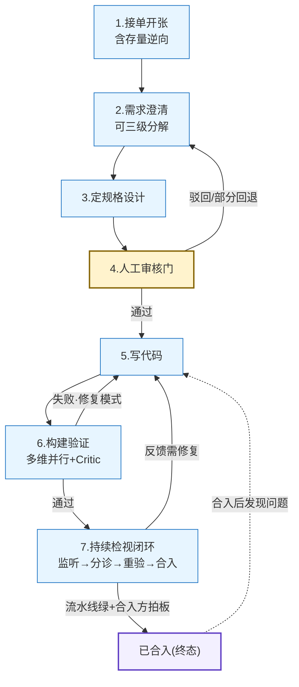

**[机-逆向理解]** [A·阶段1] 存量场景先做 P0 逆向（代码/架构/UI/业务/基础设施），区分单/多服务、全量/增量，建立基线再动手。挂场景1。
**[机-三级分解]** [A·阶段2] IR→SR→AR 逐级分解，各级回写统一参数文件，需求可逐级追溯。挂场景2。
**[机-增量 delta]** [A·阶段3] 增量模式只写变更差异（git-diff 驱动），全量模式维持仓知识完整性，双轨并存。挂场景1/3。
**[机-对抗式修复闭环]** [A·阶段6] 评审产出 ✅/❌/🔴 标记，❌ 项退回编码修复模式重改，改完回请原维度复检。挂场景6。
**[机-轮次超限升级]** [A·阶段6] 修复轮次上限（如 10 轮），超限升级人工介入，不无限打转。挂场景4/6。
**[机-持续检视闭环]** [A·阶段7] 提 MR→监听态→反馈聚合→分诊→修复→重验→合入；MR 创建是监听态非终态，合入才终态。挂场景7。

---

## B. 角色模型与协作范式

四套件涉及的人类角色是同一套：需求方、开发（责任人/owner）、测试、检视人、合入方、管理员。AI 角色因范式不同有两种编排。

### 协作范式：单中心（默认）vs 三权分立（高合规可选）

- **单中心推进**（Julo/mae-flow 默认）：一个责任人贯穿全流程，是唯一写动作归属人与推进者，其他角色会诊、门处交接。AI 承担生成主力与门内预审，产出供人决策、不替代人裁决。
- **三权分立**（BDFlow 高合规可选）：调度（仅协调）/ 决策引擎（无状态）/ 执行 / 独立验收四层隔离。决策可复现（无状态意味着同一状态文件复现同一决策）、执行可并发、验收独立。两种范式共用同一 7 阶段主干与同一门禁体系，只是角色编排不同。

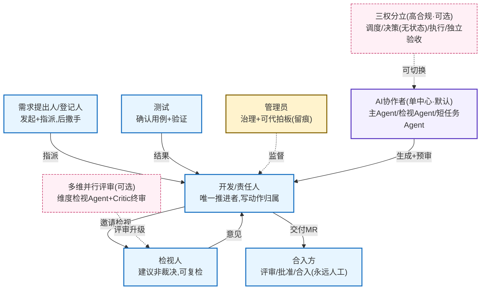

**[机-三权分立]** [B] 调度/决策(无状态)/执行/独立验收隔离，决策可复现、执行可并发、验收独立。挂场景5。
**[机-自动迭代/无人值守]** [B] AI 自主推进，人可缺席，验证子环自动多轮，超限降级人。挂场景5/9。
**[机-会诊单拍板]** [B] 审核门可邀请多人会诊（`isInvitedReviewParticipant`），但 `decided_by` 唯一，防责任稀释。挂场景4。
**[机-Critic 终审]** [B] 多维并行评审各维独立判定，汇总后 Critic 单一终审，防多头并行生效。挂场景6。

---

## C. 人机交互与交接

### 6 种交互模式

| 模式 | 形态 | 触发 | 挂载场景 |
|---|---|---|---|
| 1 配置式输入 | 结构化表单，缺项不前进 | 接单开张/参数配置 | 场景1 |
| 2 成组质询 | 一次 3-4 题各独立作答 | 需求澄清 | 场景2 |
| 3 审核门待办 | AI 预审+人拍板，带上文防盲签 | 审核门/代码检视/测试门 | 场景4/6 |
| 4 会话内追问 | AI 权限请求/结构化提问，人回复 | 任意 AI 步骤中 | 场景5 |
| 5 结果确认 | AI 产出不自动标记完成，人点确认 | 测试用例/规格确认 | 场景3 |
| 6 多维并行质询/评审 | 多维评审卡同屏并列，各维独立判定，Critic 终审 | 构建验证多维并行评审 | 场景6 |

**交互铁律**：等待不是决策；内容要带全；高影响动作验真；不伪造不代答；一卡一拍板；维度可并行·终审唯一。

### 4 条交接通道

| 通道 | 机制 | 挂载场景 |
|---|---|---|
| A 状态机暂停-决策 | 上游跑完→paused→待办(带上文)→拍板→回注推进（平台内主通道）| 场景2/4 |
| B 外部通知 | 门待办→IM 推送(Markdown+深链+审批码)，单向触发，失败不阻塞 | 场景2/4/9 |
| C 外部平台合入 | 交付 MR→CodeHub→指定三角色→轮询监听合入事实，合入永远人工 | 场景7 |
| D 持续检视监听 | MR 创建→监听态→反馈聚合→分诊→回注修复/门待办→重验→合入 | 场景7 |

**[机-事实门反盲签]** [C·模式3/通道A] 决策卡带 `preface`（举卡前上文）+ `context`（模型最后一段话）+ 材料选区，让人知道"为什么问这个"，反盲签。挂场景2/4。
**[机-接管 via=interrupt]** [C·模式4] 人可随时点"接管"（源码 `takeoverActiveOf`）拿回方向盘，不依赖门；接管以"中断"事件（`via=interrupt`）标记、中止正在跑的辅助会话（`abortAuxiliarySessions`），并把生命周期标记为"被人中断"（`lifecycle=interrupted`），区别于 AI 出错失败（failed）。挂场景5。
**[机-知识伴随注入]** [C·模式2] 澄清阶段注入业务模块库 + 仓文档，AI 不凭空猜业务规则。挂场景2。
**[机-反馈分诊]** [C·通道D] 反馈按自动可修 / 需人决策 / 仅提示三类分诊，自动可修的不惊动人。挂场景7。
**[机-通知合并]** [C·通道B] `notified` 防重复打扰；多问题合并举卡一次通知；夜间挂起通知合并到早上。挂场景2/9。

---

## D. 工作台三层骨架与统一作业流

公共工作台是三层嵌套的作业空间，三层都源于四套件已有形态：

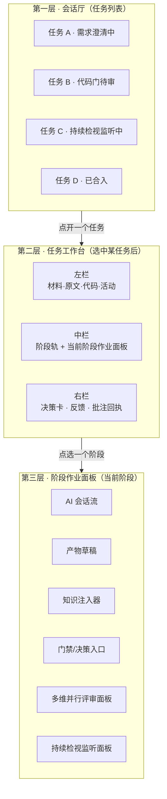

- **第一层会话厅**：一用户名下多并发任务，每条卡片显示单号/当前阶段/状态徽标/健康事实/是否等门/是否监听态。回答"我手上有几个活、哪个在等我"。
- **第二层任务工作台**：三栏（材料区 / 阶段轨+作业面板 / 决策与反馈区），保证"决策与证据同屏"。回答"这个活现在到哪、要我做什么"。
- **第三层阶段作业面板**：AI 会话流 + 产物草稿 + 知识注入 + 门禁入口同屏；构建验证阶段展开多维并行评审面板，持续检视阶段展开监听面板。回答"这个阶段我怎么干"。

### 统一作业流 5 节拍

1. **进入**（会话厅→工作台）：看健康事实与等待徽标决定是否进入；被门拉回的由 IM 深链直达。
2. **定位**（工作台→阶段轨）：阶段轨高亮当前阶段，可点选任意已完成阶段回溯（双指针 `currentStepIndex` vs `viewingStepIndex`）。
3. **作业**（阶段面板内）：AI 会话流 + 产物草稿 + 知识注入同屏；可干预（接管/取消/追加）或放任自动迭代。
4. **门处暂停**（任意阶段→人工门）：状态机暂停举卡，带 `preface`+`context`，决策卡同屏呈现材料。
5. **流转或持续检视**（门解除→下一阶段 / 交付门→持续检视→合入归档）：交付门后进监听态，合入才归档、工作区回收。

**[机-产物主权流转]** [D] 设计阶段设计师主笔 spec，拍板后主权移交开发；门后检视人只读批注。避免多人同改。挂场景3。
**[机-会话厅并发]** [D·第一层] 会话厅承载并发，徽标区分运行/等待/排队/归档，按"等我操作"优先排序。挂场景8。

---

## E. 四层扩展机制

公共工作台以**三层扩展机制**承载差异——平台靠扩展承载差异，不靠分叉。四层都插在 7 阶段主干 + 门禁体系之上，主干不可删、扩展可替换。

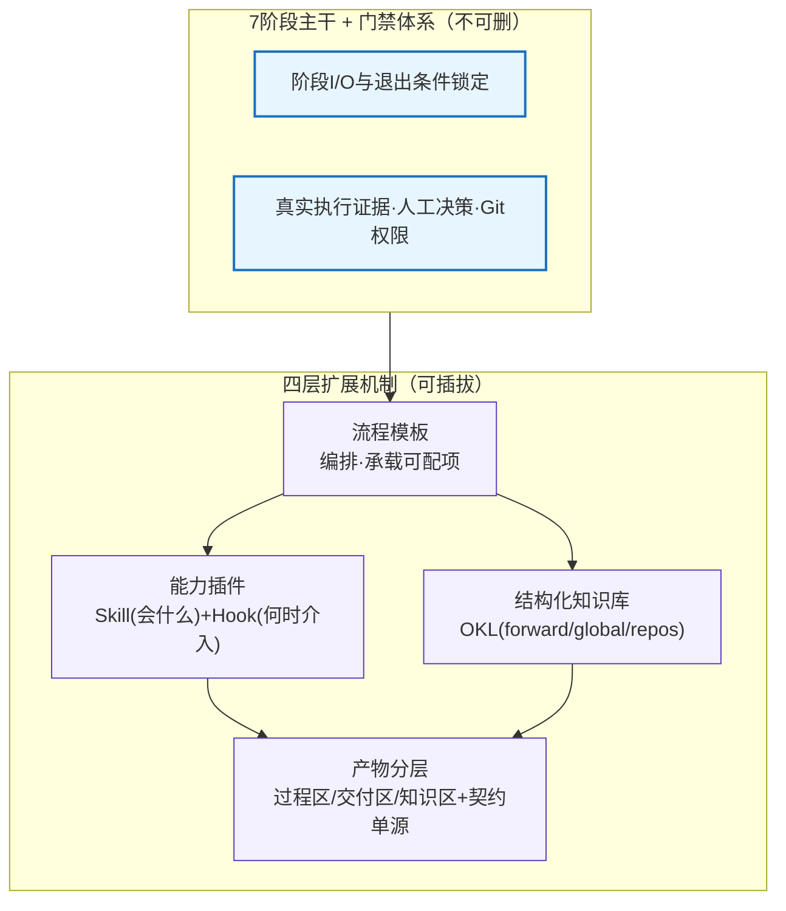

- **流程模板**（mae-flow `playbooks.json` locked vs customizable）：锁定阶段 I/O 与退出条件，开放阶段内活动/资源选择/任务指令。模板承载三分歧可配项（门否决权、协作范式、评审维度），切换模板即切换运行姿态。成熟模板可上架复用。
- **能力插件**（Skill + Hook）：Skill 是"会做什么"，Hook 是"何时介入"（流程节点前置/后置钩入）。两者协同让能力可插拔地织入流程，无需改主干。
- **结构化知识库 OKL 三层**（SUPER-HARNESS，OKL = Organized Knowledge Library，按生命周期分层组织的知识库）：forward（前向层，当前任务相关知识）/ global（全局层，团队/平台通用知识）/ repos（仓级层，单仓专属知识）。按需叠加注入，避免全局知识塞进每个任务。注入摘要可观测（`injection_summary`，即每次注入给用户回显"实际塞了什么、以什么形态塞的"）。
- **产物分层**（BDFlow）：产物分**过程区**（中间态、不入 git）/ **交付区**（承诺交付物、入 git）/ **知识区**（可复用沉淀）三分区治理。过程区与交付区物理隔离，知识区可回流团队资产。

**[机-产物分层·三分区]** [E] 过程区/交付区/知识区分层治理，过程物不入 git，知识区可回流。挂场景1/3/10。
**[机-契约单源]** [E] `api-types.ts`/`pipeline-params.json` 唯一真源，其余视图只读投影，防多版本漂移。按轮次存证、快照防漂移。挂场景3。
**[机-全量/增量双轨]** [E] delta-spec 驱动改动，full-spec 维持仓知识完整性，两者同源派生。挂场景1/3。
**[机-OKL 三层]** [E] forward/global/repos 三层知识，按需叠加注入。挂场景10。
**[机-技能沉淀闭环·人采纳]** [E] 任务证据→skillDistiller 提炼→候选池→**人工采纳**→正式技能架→下次复用。候选不自动生效，必须人采纳。挂场景10。
**[机-写入 fail-closed 留痕]** [E] 技能是团队资产，写错污染所有后续，写入从严、版本留痕、操作留痕。挂场景10。
**[机-materialize 快照]** [E] 下次任务开局把团队技能架物化快照到工作区 `host-skills/` 目录，注入任务提示词。挂场景10。
**[机-流程模板反哺]** [E] 成熟 playbook（如"存量逆向改造""高合规三权分立"）可上架为团队资产，新任务选用。挂场景10。

---

## F. 门禁、并发、可观测性

### 四类人工门

| 门 | 判什么 | 拍板人 | 可否代答 |
|---|---|---|---|
| 事实门 | 业务事实（模块归属、接口契约、业务规则）| 需求方/开发 | 不可代答 |
| 审核门 | 证据充分性（非主观质量），可配置单维/多维并行 | 检视人/Critic | 不可代答 |
| 测试门 | 测试是否真跑、是否通过 | 开发/检视人 | 不可代答 |
| 交付门 | 合入 | 合入方 | 永远人工、不可代答 |

### 反盲签决策卡构成

| 区块 | 内容 | 作用 |
|---|---|---|
| `preface` | 举卡前上文 | 防盲签——让人知道"为什么问这个" |
| `context` | 提问前模型最后一段话 | 让人看到 AI 推理上下文 |
| 材料选区 | 相关产物/diff/证据 | 决策与证据同屏，不跳页 |
| `request_digest` | 请求摘要 | 快速判断是否值得细看 |
| `decided_by` | 谁点的（管理员可替拍板）| 责任可追溯 |
| `state_version` | 状态版本号 | 乐观锁，防并发覆写 |

### 并发：部署队列 + 真隔离 + 一处真源

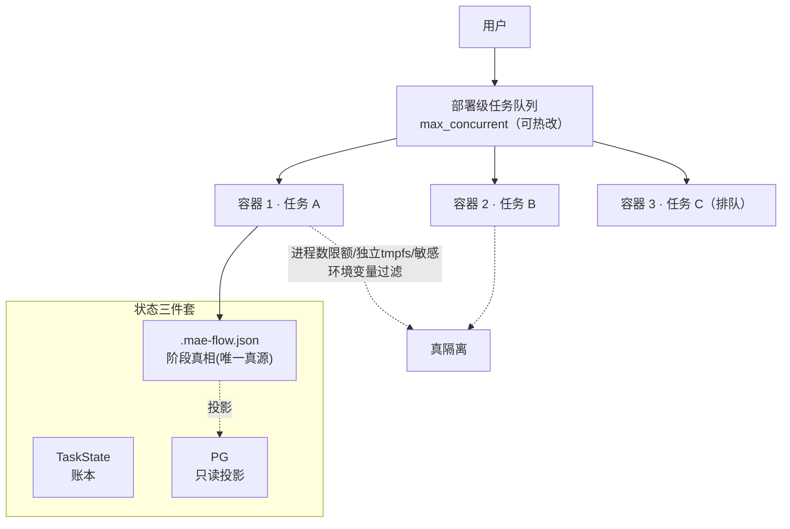

**[机-门禁·四类门]** [F] 事实门/审核门/测试门/交付门，各门拍板人不同，拍板权随阶段前移。挂场景4/7。
**[机-反盲签决策卡]** [F] 决策卡带 preface/context/材料选区/decided_by/state_version，反盲签是硬要求。挂场景2/4/7。
**[机-回退目标声明式]** [F] 回退声明跳到哪步（clarify/test_design/plan），非失败重跑；paused 再进入不重跑 AI。挂场景4。
**[机-超时升级]** [F] 门带超时预算（如 BDFlow 1 小时），超时升级通知，不自动放行。挂场景4/9。
**[机-铁门永不代答]** [F] 事实门/审核门/交付门涉及人工守的边界，无人值守也不偷偷放行；AI 可降级推进非阻塞部分，但不替人守的门放行。挂场景2/4/7/9。
**[机-AI 不卡死]** [F] 门禁采用 fail-closed（失败即停止、带预算重试），非关键旁路采用 fail-open（失败不阻断、降级放行）；人可缺席，AI 不可以僵死。挂场景9。
**[机-重试预算升级]** [F] 构建/修复失败有重试预算（如 P0e 3 次、`repair_rounds`），超限停止升级人。挂场景6/9。
**[机-部署队列真隔离]** [F] 并发容器隔离——进程数限额（PIDS_LIMIT）/ 独立临时文件系统（tmpfs）/ 敏感环境变量过滤（SECRET_ENV），容器起不来直接 failed 不降级混跑。挂场景8。
**[机-门不占并发槽]** [F] 人工门等待时释放容器（状态持久化），把并发槽让给排队任务；门解除后重建恢复。挂场景8。
**[机-一处真源]** [F] `.mae-flow.json`/STATE.md 是阶段真相唯一来源，PG/DB 是只读投影，避免两套状态机打架。挂场景8。
**[机-文件状态机]** [F] 状态以工作区文件为主（单 json / decision.json / STATE.md），DB/投影为辅。挂场景8。
**[机-会话厅并发]** [F] 见附录 D。
**[机-语义事件流]** [F] 14 类语义事件（源码 `SemanticEventKind`，如会话开始/用户消息/助手消息/工具调用/人工决策/会话结束等）统一描述所有过程，看一种流看懂任何阶段。挂场景5。
**[机-健康徽标]** [F] 任务健康事实（`taskHealthFacts`，工具连续报错等异常计数）触发徽标变色，主动叫人；Token 预算超阈预警（warning/exceeded）。挂场景5。
**[机-溯源链]** [F] 产物自动标注来源（@source 注解）+ 来源关系映射可查（source_map）+ 代码来源追溯文件（edges/nodes.jsonl，带 from-array 记录"这段代码来自哪"）+ IR→SR→AR 三级需求可逐级回溯 + 事件流持久化可重放。挂场景5/6。
**[机-评审报告防伪]** [F] 验证报告（verification-report）做来源交叉校验 + 保留分派记录（dispatch 记录：谁被分派评审了什么）+ 决策标识归因（decision_id：结论来自哪条决策），报告可追溯不可伪造。挂场景6。
**[机-交付事实远端真实]** [F] 交付卡拉远端流水线真实结果，不显示本地宣称的"测试通过"，防本地撒谎。挂场景7。
**[机-fail-closed 合入]** [F] 合入永远人工、不可代答；涉及 Git/真实推送的动作采用 fail-closed（失败即停止、绝不偷偷放行）。挂场景7。
**[机-幂等重放]** [F] SHA 失效则证据非自报，幂等重放防重复/遗漏。挂场景7。
**[机-重启恢复]** [F] 状态在文件，重启按阶段矩阵恢复，不丢状态；合入是远端动作，重启不会重复合入。挂场景9。
**[机-反幻觉]** [F] 反幻觉公规（BDFlow 5 公规 + 24 角色扩展）+ bdflow-enforcer 运行时强制，防 AI 编造。挂场景9。
**[机-门控·机器门]** [F] 逆向完成由"程序规则校验 + AI 复核"双层自动判定（不靠人拍板）。挂场景1。

---

## G. 四套件收敛映射表

> 此表把四套件在工作台各要素上的实践收敛为公共平台取法。BDFlow 与 SUPER-HARNESS 列在此前文档中缺失，本次补完为四列。

| 工作台要素 | MAE-Julo | mae-flow-cloud | BDFlow | SUPER-HARNESS | 公共平台取 |
|---|---|---|---|---|---|
| 视图单元 | 步骤（15 步侧栏）| 任务（三栏工作台）| P0-P9 分级门控流水线视图 | IR→SR→AR→Plan→Implement→Review→Test 分解视图 | **任务工作台 + 阶段轨**（任务为主、阶段为轨）|
| 流程结构 | 固定 15 步硬编排 | 7 段固定 + 9 playbook | P0-P9 分级门控，每级硬确认点 + 超时升级 | 6 阶段，AI 自评推进 + 平台守门 | **7 段固定阶段 + 可定制 playbook**（阶段兜底、活动可改）|
| 过程语言 | 15 类步骤 SSE 事件（服务器推送事件）| 14 类语义事件 | 无状态决策引擎 + decision.json | STATE.md + pipeline-params.json | **语义事件流**（统一模型，兼容步骤事件）|
| 产物 | 工作区文件 + SQLite 索引 | `.mae-flow-work/` 单文件不入 git | 产物三分区 + 契约单源 | @source 注解 + source_map | **工作区单文件不入 git + 产物三分区 + 契约单源**|
| 知识 | Veda 四模式 + 五注入 | 三源 + on_demand + 沉淀 | 产物分层知识区 | OKL 三层（forward/global/repos）| **三源 + 按需注入 + OKL 三层 + 注入摘要可观测**|
| 技能 | 无正式体系 | 三层 + skillDistiller 闭环 | 知识区可回流团队资产 | Skill/Hook 能力插件 | **三层 + 沉淀闭环（人采纳才生效）+ Skill/Hook 插件**|
| 并发 | 单工作流 8 会话，多实例 | 部署队列 2 可热改，容器隔离 | 无状态决策 + pilot.lock 原子锁 + 调度执行分离 | 自评推进，平台单守门 | **部署队列 + 真隔离 + 一处真源 + 门不占并发槽**|
| 门禁 | 三处 gate handler | humanGate 任意阶段举卡 | 5 硬确认点 + 1h 超时升级 | HARD GATE + 自评推进 + 平台守门三件事 | **四类门 + 反盲签决策卡 + 乐观锁 + 超时升级**|
| 回溯 | 双指针 + prompt dump（提示词导出）| 任务历程 + 语义流 | 决策可复现 + 按轮次存证 | @source 注解 + source_map + STATE.md 重放 | **任务历程 + 双指针 + 语义流 + 溯源链**|
| 需求分解 | 两级（澄清→设计）| 两级 | 两级（PRD→SR 按管理对象）| **三级 IR→SR→AR** | **两级默认 / 三级可选**，各级回写统一参数 |
| 评审 | 单检视人门内预审 | 单检视人 + 检视邀请闭环 | 多角色交叉 + 独立 Critic 终审 | **6~7 维并行 + Critic** | **评审维度数可配**：默认单检视人，可启用多维并行 + Critic 终审 |
| 协作范式 | 单中心 | 单中心 | **三权分立**（调度/决策/执行/验收）| 单中心 + 多维并行评审 | **单中心默认 / 三权分立高合规可选**，共用同一主干与门禁 |
| 状态模型 | SQLite WAL（预写日志并发模式）+ 步骤状态 | `.mae-flow.json` 真源 + PG 投影 | decision.json + 文件驱动状态机 | STATE.md + pipeline-params.json | **工作区文件为真源，DB/投影只读**（一处真源多处只读）|
| 扩展机制 | 静态映射（PROMPT/RUNNER_MODULE_MAP）| playbook locked/customizable | 产物分层 + 契约单源 | OKL + Skill/Hook | **四层扩展机制**（流程模板/能力插件/OKL/产物分层）|
| 评审修复闭环 | Loop 迭代（test_gen→…→回退）| 检视意见逐条闭环 + re-verify | 对抗式修复 + 10 轮上限 + 报告防伪 | REVIEW→REVIEW-FIX + ${FILES_TO_READ} 范围一致 | **对抗式修复闭环 + 轮次超限升级 + 评审报告防伪**|
| 持续检视 | submit_mr 多仓 + CodeHub 降级 | **delivery_watch 监听态 + 5 源分诊 + 9 不变量** | 提 MR→独立验收 | api-test 多维验证 / test_only 无 MR | **持续检视闭环**：MR 创建非终态，反馈聚合→分诊→重验→合入 |

### 理念收敛

四套件表面分歧（流程驱动 vs 任务驱动、步骤即视图 vs 决策同屏、单中心 vs 三权分立、两级 vs 三级分解），在工作台层面收敛为互补：**流程要可见（阶段轨）、决策要同屏（任务工作台）、过程要透明（语义事件流）、知识要沉淀（四层扩展闭环）、人机边界要清晰（门禁反盲签 + AI 不卡死）**。这五条是公共工作台的形态骨架。

---

## H. 共性要素与设计原则清单

### 12 个共性要素

| # | 共性要素 | 业务含义 |
|---|---|---|
| 1 | **开发方式分流** | 同一套流程支持 完整开发/问题修复/小幅调整/处理评审/存量逆向改造 多种走法 |
| 2 | **强制澄清环节** | 编码前必须把需求问清楚，产出无歧义需求 + 决策记录，可结构化为 IR→SR→AR 三级 |
| 3 | **规格+设计双产物** | 分清 WHAT 和 HOW，支持全量/增量，产物按三分区治理、契约单源 |
| 4 | **编码前人工门** | 方案必须经人确认，门可驳回回退/部分回退，触发通知，带超时升级 |
| 5 | **写/修双模式编码** | 既能写新代码，也能带失败日志修既有代码；决策与执行可分离 |
| 6 | **多维并行+编译+测试三段验证** | 多维并行评审 + Critic 终审 + 编译 + 测试，对抗式修复闭环，测试可跳过 |
| 7 | **持续检视闭环交付** | 一仓一 MR；MR 创建是监听态非终态，反馈聚合→分诊→修复→重验→合入，合入永远人工 |
| 8 | **反馈回退环** | 验证失败、持续检视反馈、合入后发现问题，都能回退到写代码继续迭代 |
| 9 | **存量逆向理解** | 存量场景先做 P0 逆向，区分单/多服务、全量/增量，建立基线再动手 |
| 10 | **需求三级分解** | IR→SR→AR 逐级分解，各级回写统一参数文件，需求可逐级追溯 |
| 11 | **多维并行评审 + 对抗式修复** | 6~7 维并行评审或交叉评审 + Critic 终审，对抗式修复闭环，轮次超限升级 |
| 12 | **产物分层与契约单源** | 产物分过程区/交付区/知识区，契约单一来源防多版本漂移，按轮次存证、快照防漂移 |

### 8 条设计原则

1. **内核协调事实，不裁判质量**：模板/关键词/归档凭证/提交格式不享否决权，质量失败如实提示但不阻断 `done`；权限/取消接管/人的实际回答/真实推送流水线事实仍由内核守边界。
2. **决策发生在哪里，证据就在哪里**：审批卡问"Spec 确认"时，Spec 必须同一屏可读。反盲签——举卡前必给上文。
3. **阶段顺序与退出条件平台兜底，阶段内活动可定制**：不可删的是阶段 I/O 与退出条件、真实执行证据、人工决策、Git 权限；可改的是可选活动、资源选择、任务指令。
4. **AI 不能因 harness 卡死**：任何人工门禁超时/无人响应，AI 有降级路径可继续，不无限挂起。人可以缺席，AI 不可以僵死。
5. **阶段真相只有一个来源**：工作区单文件为唯一真源，前端/后端/数据库皆为只读投影。一处真源，多处只读。
6. **每门一个拍板人，拍板权随阶段前移**：澄清/设计→开发，审核门→检视人，交付→合入方。问题问事实、合入永远人工，是不可代答的两道铁门。
7. **产物分层 + 契约单一来源**：过程区/交付区/知识区三分区治理；契约唯一真源，其余皆为投影。交付物与过程物分离，契约唯一防多版本漂移。
8. **可扩展性**：四层扩展机制（流程模板 + 能力插件 + 结构化知识库 + 产物分层）承载差异。阶段 I/O 锁定，阶段内活动/能力/知识可插拔。平台靠扩展承载差异，不靠分叉。

### 3 类协作范式分歧（均可配置策略，不破坏流程主干）

| 分歧点 | 选项 | 公共平台建议 |
|---|---|---|
| 门的否决权 | 阻塞式（Julo/BDFlow）/ 建议式（mae-flow）/ 对抗式闭环（SUPER-HARNESS）| 可配置策略 |
| 协作范式 | 单中心（Julo/mae-flow 默认）/ 三权分立（BDFlow 高合规可选）| 单中心默认，三权分立可选 |
| 评审维度 | 单检视人（Julo/mae-flow 默认）/ 多维并行 + Critic（SUPER-HARNESS/BDFlow）| 维度数与是否设 Critic 均为模板可配项 |

---

*本文以 10 个业务场景为正文主干，每个场景 dramatize 一个真实张力并挂四套件走法 + 共性机制 + 摩擦应对；附录机制索引 A-H 压缩四套件业务流/协作/工作台分析为可查设计词典，场景以 `[机-Mx]` 反向引用；收口章 I 把场景与机制收敛为目标态平台设计方案。可作为公共平台的业务流程、协作设计、工作台形态与场景验收蓝本输入，并直接指导平台研发。*

---

# I. 从场景分析到平台设计——目标态收口

> 前面 10 个场景回答"用户在真实情境下怎么用、卡在哪、怎么应对"，附录 A-H 回答"四套件有哪些共性机制可复用"。本收口章把两者收敛为**目标态公共平台的整体设计方案**——它不是又一轮分析，而是从分析到设计的落地：**用户实际诉求 → 场景承接 → 目标态架构 → 平台能力清单**。
>
> 目标态平台的定位：一个以"需求到代码合入"为主线、**以场景为验收依据、以机制为设计构件、靠扩展承载差异**的公共 Agent 平台。它不偏向四套件任何一个，而是把四者的强项拼成一个完整作业空间。

---

## I.1 用户实际诉求 → 场景覆盖矩阵

> 10 个场景不是凭空选的，每条都承接一组真实用户诉求。下表把"谁、在什么痛点下、要什么"映射到场景，并标注诉求强度与覆盖情况，确保场景集对真实诉求的覆盖可审计。

| # | 用户实际诉求（谁·痛点·要什么）| 承接场景 | 诉求强度 | 对应四套件已有实践 |
|---|---|---|---|---|
| 1 | **开发·存量代码看不懂却要动手**——接手既有仓改造，3 万行不敢直接改，要"先读懂切片再动手" | 场景1 存量代码接手 | 高（存量是绝大多数真实单）| BDFlow P0 逆向 / mae-flow analyze / Julo explore |
| 2 | **PO·一句话提需求不想懂流程**——提完想走，要"系统把一句话落成可验收项，该问的问到" | 场景2 三级分解澄清 | 高 | SH IR→SR→AR / mae-flow grill / Julo clarify |
| 3 | **设计师+开发·方案要讨论也要分清 WHAT/HOW**——多人协作出 spec，过程草稿不能污染交付，契约不能漂移 | 场景3 定规格设计 | 高 | BDFlow 产物三分区+契约单源 / mae-flow 双轨 spec / Julo plan |
| 4 | **检视人·要把关方案但不能被卡死**——会诊意见可冲突但拍板要唯一，回退要有目标不无限循环 | 场景4 人工门会诊 | 高 | BDFlow 5 硬确认点 / SH HARD GATE / mae-flow humanGate / Julo 多目标回退 |
| 5 | **开发·放任 AI 写但要随时接管**——同时管多个任务，AI 试错跑飞要能叫回来，自报完成不能全信 | 场景5 AI 迭代接管 | 高 | BDFlow 三权分立 / SH wave TDD / mae-flow 单写者 / Julo Loop+SSE |
| 6 | **检视人·单看易漏维度，要多维把关防伪造**——功能过了安全没看，评审报告还要防 AI 伪造 | 场景6 多维并行评审 | 中高 | SH 6~7 维 / BDFlow 交叉+Critic+防伪 / mae-flow re-verify |
| 7 | **合入方·提了 MR 不等于合入，要真闭合**——反馈持续到来，AI 自称已处理不算，要远端真绿才合 | 场景7 持续检视闭环 | 高 | mae-flow delivery_watch / BDFlow 独立验收 / SH api-test |
| 8 | **开发·多任务并发，人思考不该阻塞机器**——5 个任务 2 个并发槽，等门别占容器，状态别打架 | 场景8 并发调度 | 高 | mae-flow 部署队列 / BDFlow 文件状态机 / SH STATE.md / Julo SessionMapper |
| 9 | **运维/开发·夜间无人值守但要守边界**——AI 自主跑，铁门不代答，跑飞别烧资源，重启别丢状态 | 场景9 无人值守 | 中 | BDFlow Cron+反幻觉 / SH 自评推进 / mae-flow moonlight+重启恢复 |
| 10 | **团队·经验要沉淀别流失**——踩过的坑下次别再踩，AI 不能自我强化错误做法 | 场景10 知识反哺 | 中高 | mae-flow skillDistiller / SH sdd-self-improving / Julo 缺口 |

**覆盖评估**：
- **高优先诉求全覆盖**（1~8 强度"高"的诉求全部有专属场景承接）。
- **两类诉求显式留口**：①"纯新功能绿地开发"——场景1 已含绿地分流（B3）但未单列场景，因绿地无逆向张力、机制已被其余场景覆盖；②"跨团队/跨组织协作"——四套件均未触及，属目标态待探索区，不在本设计范围。
- **四套件差异化诉求已纳入**：BDFlow 的存量逆向/三权分立、SUPER-HARNESS 的三级分解/多维评审、mae-flow 的持续检视/知识沉淀——这些在旧版 8 场景里缺席的，现已补齐。

---

## I.2 目标态平台整体架构

> 架构按**四层扩展机制**分层（呼应附录 E），自下而上：基础运行时 → 内核主干 → 能力扩展 → 交互作业。主干不可删、扩展可替换，平台靠扩展承载四套件差异，不靠分叉代码。

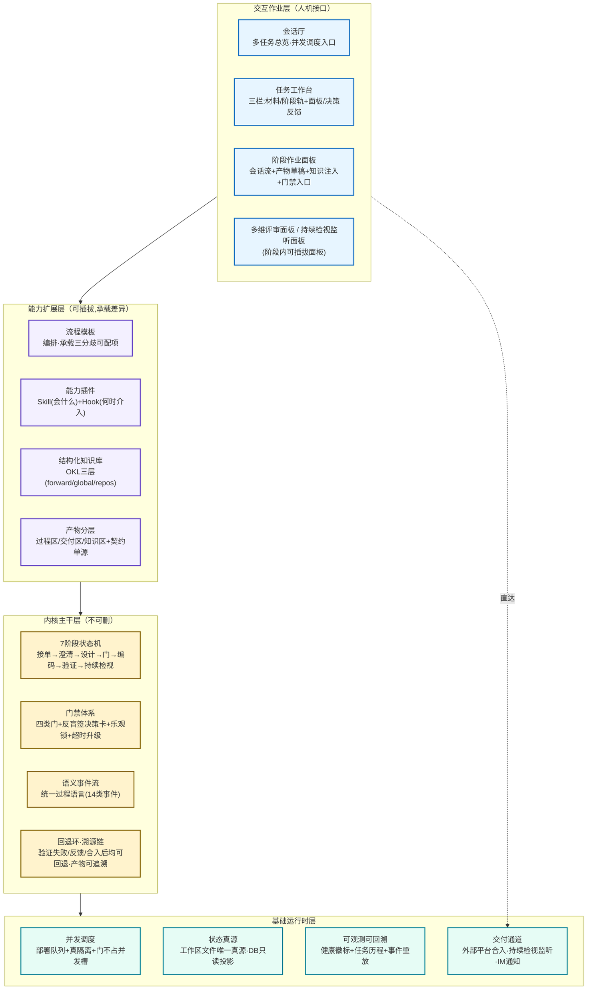

### 各层职责与层间接口

| 层 | 职责 | 关键构件（回扣附录）| 对外接口 |
|---|---|---|---|
| **L4 交互作业层** | 人机接口：管多任务、做单任务、干单阶段 | 会话厅 / 任务工作台 / 阶段面板 / 多维评审面板 / 持续检视监听面板（附录 D 三层骨架）| 向下：调用 L3 能力与 L2 主干；向上：6 种交互原语（附录 C）|
| **L3 能力扩展层** | 承载差异：编排、能力、知识、产物治理 | 流程模板 / 能力插件(Skill+Hook) / OKL 知识库 / 产物分层+契约单源（附录 E 四层）| 插拔接口：流程模板声明可配项；Skill/Hook 按 Hook 点注册；知识按 forward/global/repos 注入；产物按三分区落盘 |
| **L2 内核主干层** | 不可删的流程骨架与底线机制 | 7 阶段状态机 / 四类门禁 / 语义事件流 / 回退环+溯源链（附录 A/F）| 状态机推进 API；门禁举卡/解除 API；事件流发布/订阅；溯源查询 API |
| **L1 基础运行时层** | 运行支撑：并发、状态、可观测、交付 | 部署队列+真隔离 / 工作区文件真源 / 健康徽标+任务历程+重放 / 外部合入+持续检视监听+IM 通知（附录 F）| 队列调度 API；真源读写 API（单写多读）；事件持久化；远端平台适配器 |

**层间三条不变量**（架构红线）：
1. **L2 主干对 L3 不可见**——主干状态机只认阶段 I/O 与退出条件，不依赖具体流程模板/插件，保证主干可独立演进。
2. **L3 扩展不触碰 L1 真源**——扩展层只能通过 L2 暴露的 API 读写状态，不可直写工作区文件真源，保证一处真源。
3. **L4 交互永远可降级到 L2**——即便 L3 扩展缺失/L4 面板未加载，主干状态机+门禁+事件流仍可裸跑（对应"AI 不卡死"原则），人通过事件流与门禁仍能推进任务。

---

## I.3 平台能力清单（场景验收 → 必备能力 → 构件）

> 这张表是"场景验收清单"与"平台设计"的对接：左列是 10 个场景的验收点（场景跑通必须能做什么），中列是平台为支撑它必须具备的能力项，右列是该能力由哪个架构构件/机制落实。研发可据此拆 Epic/Story。

| 场景验收点（必须能做什么）| 平台必备能力项 | 落实构件 / 机制 |
|---|---|---|
| **场景1** 存量单能读懂切片再动手 | 存量逆向理解（全量/增量、单/多服务）+ 逆向产物入过程区 + 双层自动校验门 | L2 状态机·阶段1 + L3 产物分层·过程区 + `[机-逆向理解]`/`[机-门控·机器门]` |
| **场景2** 一句话落成可验收原子项 | 成组质询 + 三级分解(可选) + 事实门反盲签 + 知识伴随注入 + 统一参数合并写 | L2 门禁·事实门 + L3 知识库·按需注入 + `[机-三级分解]`/`[机-事实门反盲签]` |
| **场景3** WHAT/HOW 双产物且不污染交付 | 规格设计双产物 + 产物三分区 + 契约单源 + 全量/增量双轨 + 产物主权流转 | L3 产物分层 + `[机-产物分层·三分区]`/`[机-契约单源]`/`[机-产物主权流转]` |
| **场景4** 人确认方案、可会诊可回退不无限循环 | 四类门 + 反盲签决策卡 + 会诊单拍板 + 声明式回退 + 超时升级 + 轮次超限升级 | L2 门禁体系 + `[机-门禁·四类门]`/`[机-会诊单拍板]`/`[机-回退目标声明式]` |
| **场景5** AI 自动写、人随时接管、自报有证据 | 自动迭代模式 + 接管(via=interrupt) + 语义事件流 + 健康徽标 + 文件存在校验 + 溯源链 | L2 事件流+回退环 + L3 能力插件 + L1 可观测 + `[机-接管 via=interrupt]`/`[机-健康徽标]` |
| **场景6** 多维并行评审、对抗修复、报告防伪 | 多维并行评审 + Critic 终审 + 对抗式修复闭环 + 轮次超限升级 + 评审报告防伪 | L3 流程模板(评审维度可配) + L2 门禁 + `[机-多维并行评审]`/`[机-评审报告防伪]` |
| **场景7** MR 监听态、反馈分诊、真闭合才合入 | 持续检视闭环 + 反馈分诊 + 交付事实远端真实 + fail-closed 合入 + 幂等重放 + SHA 校验 | L1 交付通道·持续检视监听 + L2 状态机·阶段7 + `[机-持续检视闭环]`/`[机-交付事实远端真实]` |
| **场景8** 多任务并发、等门不占槽、状态不打架 | 部署队列+真隔离 + 门不占并发槽 + 一处真源多处只读 + 文件状态机 | L1 并发调度+状态真源 + `[机-会话厅并发]`/`[机-门不占并发槽]`/`[机-一处真源]` |
| **场景9** 无人值守守边界、跑飞不烧资源、重启不丢状态 | 铁门永不代答 + AI 不卡死 + 重试预算升级 + 通知合并 + 重启恢复 + 反幻觉 | L2 门禁·fail-closed + L1 可观测+状态真源 + `[机-铁门永不代答]`/`[机-重启恢复]` |
| **场景10** 经验沉淀、人采纳、错可回滚 | 技能沉淀闭环 + 写入 fail-closed 留痕 + 物化快照注入 + OKL 三层 + 流程模板反哺 | L3 能力插件+知识库+产物分层 + `[机-技能沉淀闭环·人采纳]`/`[机-写入 fail-closed 留痕]` |

### 平台能力清单（按架构层归并，指导研发拆分）

**L1 基础运行时层**（先建，一切之上）：
- 并发调度：部署队列（max_concurrent 可热改）+ 容器真隔离 + 人工门不占并发槽
- 状态真源：工作区文件唯一真源 + DB/PG 只读投影 + 乐观锁(state_version)
- 可观测可回溯：健康徽标(taskHealthFacts) + 任务历程(TaskJourney) + 事件持久化可重放
- 交付通道：外部平台合入适配器 + 持续检视监听(delivery_watch) + IM 通知(合并/优先级)

**L2 内核主干层**（流程骨架，不可删）：
- 7 阶段状态机：接单→澄清→设计→门→编码→验证→持续检视，含开发方式分流
- 门禁体系：四类门(事实/审核/测试/交付) + 反盲签决策卡 + 超时升级 + 声明式回退
- 语义事件流：14 类语义事件统一过程语言
- 回退环·溯源链：验证失败/持续检视反馈/合入后反馈均可回退；产物@source+source_map可追溯

**L3 能力扩展层**（承载差异，可插拔）：
- 流程模板：playbook locked/customizable，承载三分歧可配项(门否决权/协作范式/评审维度)
- 能力插件：Skill(会什么)+Hook(何时介入)，技能沉淀闭环(人采纳)+写入fail-closed留痕
- 结构化知识库：OKL 三层(forward/global/repos) + 按需注入 + 注入摘要可观测
- 产物分层：过程区/交付区/知识区 + 契约单源 + 全量/增量双轨 + 产物主权流转

**L4 交互作业层**（人机接口，承载五套焦点视角）：
- 会话厅：多任务总览 + 并发调度入口 + 徽标排序
- 任务工作台：三栏(材料/阶段轨+面板/决策反馈) + 决策与证据同屏
- 阶段作业面板：会话流+产物草稿+知识注入+门禁入口同屏
- 可插拔专项面板：多维并行评审面板 + 持续检视监听面板

### 四条硬约束的架构落点

| 硬约束 | 架构落点 |
|---|---|
| 铁门永不代答 | L2 门禁·fail-closed（合入/事实/审核门超时不放行，只升级）；L1 交付通道·远端真绿才合入 |
| 决策必有证据同屏 | L4 任务工作台·反盲签决策卡（preface/context/材料选区同屏）；L2 门禁·决策卡必带证据 |
| 过程永远可接管可回溯 | L1 可观测(健康徽标+事件重放) + L2 事件流(via=interrupt)+溯源链 + L4 接管入口常驻 |
| 产物分层契约单源 | L3 产物分层(三分区+契约单源) + L1 状态真源(一处真源多处只读) |

---

> **从本文到研发**：L1→L2→L3→L4 的能力清单可直接拆为研发 Epic（按层并行、L1/L2 优先）；10 个场景的"摩擦与应对"即各 Epic 的验收用例；四条硬约束即架构红线测试。场景分析至此完成向"平台整体设计方案"的收口。